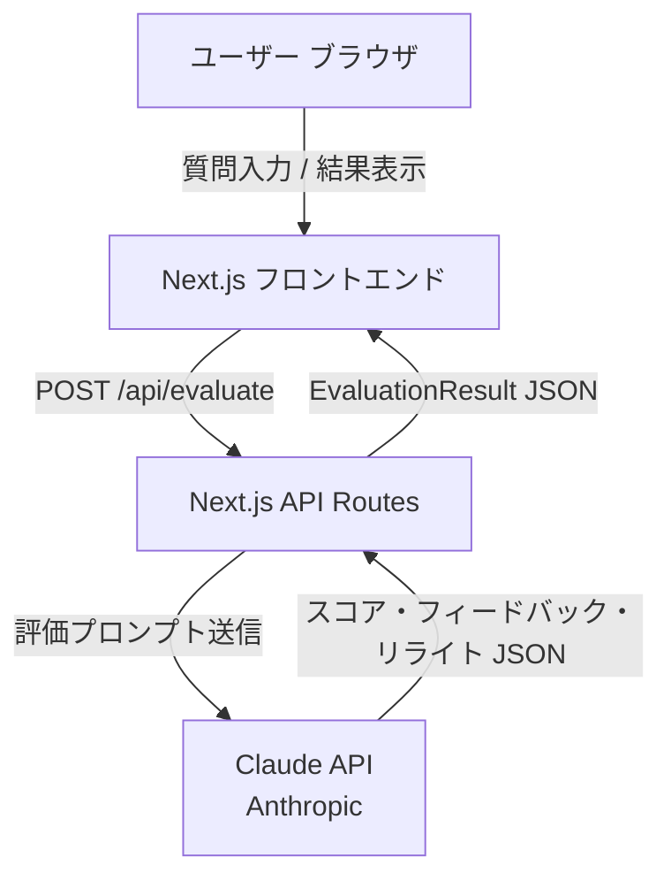
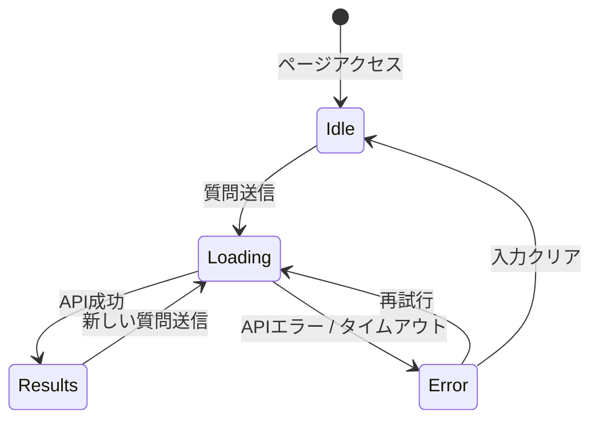
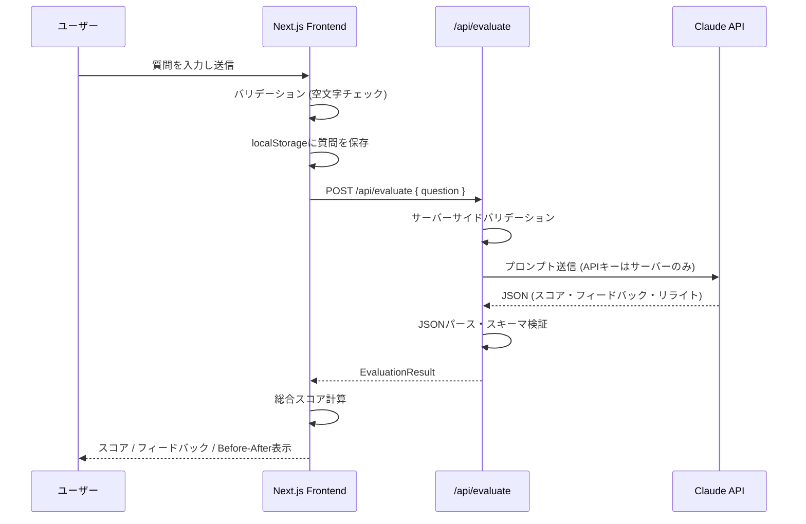

# 機能設計書 (Functional Design Document)

## システム構成図



## 技術スタック

| 分類 | 技術 | 選定理由 |
|------|------|----------|
| 言語 | TypeScript 5.x | 型安全性・PRDのデータモデルをそのまま型定義できる |
| フレームワーク | Next.js 14 (App Router) | フロントエンドとAPIルートを1リポジトリで管理でき構成がシンプル |
| スタイリング | Tailwind CSS | ユーティリティクラスでBefore/After比較などの複雑なレイアウトを素早く構築 |
| AI API | Anthropic Claude API (claude-sonnet-4-6) | 最新の高精度モデルで質問評価・リライトの品質を確保 |
| パッケージマネージャー | npm | CLAUDE.mdに定義された標準 |

---

## データモデル定義

### エンティティ: EvaluationRequest

```typescript
interface EvaluationRequest {
  question: string;   // ユーザー入力質問 (1〜1000文字)
}
```

**制約**:
- `question` は空文字不可、1000文字以内

---

### エンティティ: DimensionScore

```typescript
interface DimensionScore {
  score: number;     // 0〜100の整数
  reason: string;    // スコア算出根拠 (1〜2文)
  feedback: string;  // 改善提案テキスト (1〜3文)。スコア80以上は空文字
}
```

---

### エンティティ: EvaluationResult

```typescript
interface EvaluationResult {
  originalQuestion: string;
  scores: {
    specificity: DimensionScore;    // 具体性
    context: DimensionScore;        // 前提情報
    clarity: DimensionScore;        // 目的の明確さ
    answerability: DimensionScore;  // 回答可能性
    total: number;                  // 総合スコア (0〜100, 各25%加重平均)
  };
  overallFeedback: string;          // 総合改善サマリー (1〜2文)
  rewrittenQuestion: string;        // リライト後の質問
}
```

**制約**:
- `total` = (`specificity.score` + `context.score` + `clarity.score` + `answerability.score`) / 4
- `total` が90以上の場合、`rewrittenQuestion` は `"__HIGH_QUALITY__"` 定数を返し、フロントエンド側で「十分良い質問です」と表示する

---

## スコアリングアルゴリズム

### 4観点スコアリング（Claude APIに委譲）

スコア計算はClaude APIへのプロンプトで実行し、構造化JSONで返却を要求する。

**プロンプト設計**:
```
以下の質問を4つの観点で0〜100点の整数でスコアリングし、
指定のJSON形式のみで返してください。

# 評価する質問
{{question}}

# 評価観点
- specificity: 具体性（どれくらい具体的か）
- context: 前提情報（状況説明が含まれているか）
- clarity: 目的の明確さ（何を達成したいかが伝わるか）
- answerability: 回答可能性（第三者が答えやすいか）

# 出力フォーマット (JSON のみ、説明文は不要)
{
  "specificity": { "score": <0-100>, "reason": "<1-2文>", "feedback": "<1-3文 or 空文字>" },
  "context":     { "score": <0-100>, "reason": "<1-2文>", "feedback": "<1-3文 or 空文字>" },
  "clarity":     { "score": <0-100>, "reason": "<1-2文>", "feedback": "<1-3文 or 空文字>" },
  "answerability":{ "score": <0-100>, "reason": "<1-2文>", "feedback": "<1-3文 or 空文字>" },
  "overallFeedback": "<1-2文>",
  "rewrittenQuestion": "<リライト後の質問 or __HIGH_QUALITY__>"
}

# ルール
- scoreが80以上の観点はfeedbackを空文字にする
- 総合スコア((4観点の平均))が90以上の場合はrewrittenQuestionを"__HIGH_QUALITY__"にする
- JSON以外のテキストは出力しない
```

### 総合スコア計算（フロントエンド / API側）

```typescript
function calcTotal(scores: EvaluationResult['scores']): number {
  const { specificity, context, clarity, answerability } = scores;
  return Math.round(
    (specificity.score + context.score + clarity.score + answerability.score) / 4
  );
}
```

---

## コンポーネント設計

### APIレイヤー: `/api/evaluate` (Next.js Route Handler)

**責務**:
- リクエストバリデーション
- Claude APIへのプロンプト送信
- レスポンスのパース・バリデーション
- エラーハンドリング

**インターフェース**:
```typescript
// POST /api/evaluate
// Request Body: EvaluationRequest
// Response: EvaluationResult | ErrorResponse

interface ErrorResponse {
  error: string;   // ユーザー向けエラーメッセージ
  code: string;    // 'VALIDATION_ERROR' | 'API_ERROR' | 'TIMEOUT'
}
```

---

### フロントエンドコンポーネント

#### `QuestionInput`

**責務**: 質問テキストエリア + 送信ボタン + バリデーション表示

```typescript
interface QuestionInputProps {
  onSubmit: (question: string) => void;
  isLoading: boolean;
}
```

#### `ScoreDisplay`

**責務**: 4観点スコア + 総合スコアのカード表示

```typescript
interface ScoreDisplayProps {
  scores: EvaluationResult['scores'];
}
```

**カラーコーディング**:
- スコア 0〜49: 赤 (`text-red-600`)
- スコア 50〜74: 黄 (`text-yellow-600`)
- スコア 75〜89: 青 (`text-blue-600`)
- スコア 90〜100: 緑 (`text-green-600`)

#### `FeedbackSection`

**責務**: 観点別フィードバック + 総合サマリーの表示

```typescript
interface FeedbackSectionProps {
  scores: EvaluationResult['scores'];
  overallFeedback: string;
}
```

#### `RewriteSection`

**責務**: リライト後の質問表示 + コピーボタン

```typescript
interface RewriteSectionProps {
  rewrittenQuestion: string;  // "__HIGH_QUALITY__" の場合は特別表示
  originalQuestion: string;
}
```

#### `BeforeAfterComparison`

**責務**: 元の質問（スコア付き）とリライト後の質問を2カラムで並列表示

```typescript
interface BeforeAfterComparisonProps {
  originalQuestion: string;
  totalScore: number;        // Before側のスコア表示に使用
  rewrittenQuestion: string; // "__HIGH_QUALITY__" の場合は特別表示
}
```

---

## 画面遷移図



---

## ユースケース図

### メインフロー: 質問評価



---

## API設計

### POST /api/evaluate

**リクエスト**:
```json
{
  "question": "これどうやるの？"
}
```

**レスポンス (成功)**:
```json
{
  "originalQuestion": "これどうやるの？",
  "scores": {
    "specificity":    { "score": 10, "reason": "対象が不明確です", "feedback": "何について聞いているかを明示してください" },
    "context":        { "score": 20, "reason": "状況説明がありません", "feedback": "現在の環境や試したことを追記してください" },
    "clarity":        { "score": 30, "reason": "目的が不明です", "feedback": "達成したいゴールを一文で書いてください" },
    "answerability":  { "score": 15, "reason": "情報が不足しています", "feedback": "第三者が答えられるよう具体的な情報を含めてください" },
    "total": 19
  },
  "overallFeedback": "質問が非常に抽象的で、対象・状況・目的のいずれも不明です。具体的な情報を追加してください。",
  "rewrittenQuestion": "Next.jsでAPIからデータを取得して表示する方法を教えてください。現在fetchを使っていますがうまく表示されません。"
}
```

**エラーレスポンス**:
```json
{
  "error": "質問を入力してください",
  "code": "VALIDATION_ERROR"
}
```

**エラーコード**:
| コード | HTTPステータス | 条件 |
|--------|--------------|------|
| `VALIDATION_ERROR` | 400 | 空文字・1000文字超 |
| `API_ERROR` | 502 | Claude API呼び出し失敗 |
| `TIMEOUT` | 504 | 30秒以内に応答なし |

---

## UI設計

### 画面レイアウト

```
┌──────────────────────────────────────────────────────┐
│  QuestionCoach                                        │
│  質問力を高めるAI評価ツール                              │
├──────────────────────────────────────────────────────┤
│  [質問を入力してください...              (1000文字以内)]  │
│  [               評価する (Ctrl+Enter)              ]  │
├──────────────────────────────────────────────────────┤
│  総合スコア: 19 / 100  ██░░░░░░░░                     │
│                                                      │
│  具体性  10  前提情報  20  明確さ  30  回答可能性  15   │
├──────────────────────────────────────────────────────┤
│  改善フィードバック                                     │
│  ⚠ 具体性: 対象が不明確です。何について...               │
│  ⚠ 前提情報: 状況説明がありません。...                   │
│  ...                                                 │
├──────────────────────────────────────────────────────┤
│  Before (19点)           After                        │
│  ─────────────────────  ──────────────────────────── │
│  これどうやるの？         Next.jsでAPIからデータを...     │
│                          [コピー]                     │
└──────────────────────────────────────────────────────┘
```

### カラーコーディング（スコア帯）

| スコア | 色 | Tailwind |
|-------|----|---------|
| 0〜49 | 赤 | `text-red-600` / `bg-red-50` |
| 50〜74 | 黄 | `text-yellow-600` / `bg-yellow-50` |
| 75〜89 | 青 | `text-blue-600` / `bg-blue-50` |
| 90〜100 | 緑 | `text-green-600` / `bg-green-50` |

---

## エラーハンドリング

| エラー種別 | 処理 | ユーザーへの表示 |
|-----------|------|-----------------|
| 空文字入力 | 送信をブロック | 「質問を入力してください」 |
| 1000文字超 | 送信をブロック | 「1000文字以内で入力してください（現在: N文字）」 |
| Claude APIエラー | ローディング解除、再試行ボタン表示 | 「評価に失敗しました。もう一度お試しください」 |
| タイムアウト（30秒） | ローディング解除、再試行ボタン表示 | 「応答がタイムアウトしました。再試行してください」 |
| JSONパース失敗 | ローディング解除 | 「評価結果の読み込みに失敗しました」 |

---

## パフォーマンス最適化

- **ストリーミング非対応（MVP）**: Claude APIのストリームは使用せず、全レスポンス受信後に一括表示。実装をシンプルに保つ
- **localStorageキャッシュ**: 直前の評価結果をlocalStorageに保存し、ページリロード後も入力質問を復元する

---

## セキュリティ考慮事項

- **APIキー秘匿**: `ANTHROPIC_API_KEY` は `.env.local` に定義し、Next.js APIルート（サーバーサイド）のみで参照する。`NEXT_PUBLIC_` プレフィックスは使用しない
- **XSS対策**: ユーザー入力および Claude APIレスポンスはReactのJSXテンプレートでレンダリングし、`dangerouslySetInnerHTML` は使用しない
- **入力長制限**: フロントエンドとAPIルート両方で1000文字上限のバリデーションを実施する

---

## テスト戦略

### ユニットテスト
- `calcTotal()` 関数: 各観点スコアの加重平均計算
- バリデーション関数: 空文字・1000文字超のエッジケース
- `ScoreDisplay` コンポーネント: スコア帯ごとのカラー出力

### 統合テスト
- POST `/api/evaluate`: 正常系・バリデーションエラー・API模擬エラーの各ケース

### E2Eテスト（手動）
- 質問入力 → 送信 → スコア表示 → コピーボタン動作の確認
- エラー時の再試行フロー確認
