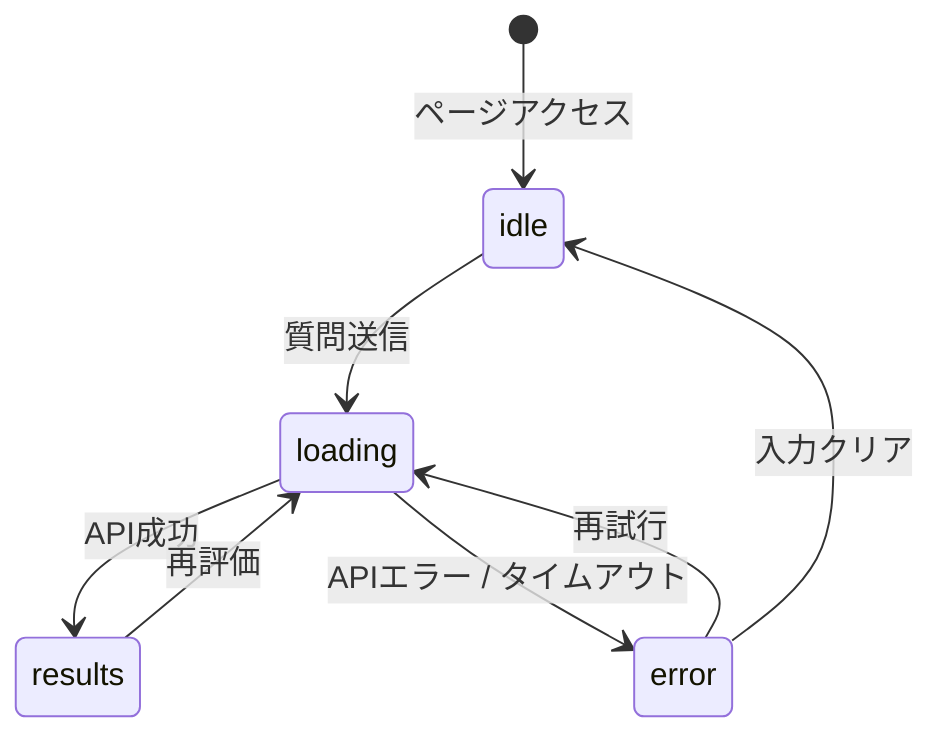

# プロジェクト用語集 (Glossary)

## 概要

このドキュメントは、QuestionCoach プロジェクト内で使用される用語の定義を管理します。

**更新日**: 2026-05-03

---

## ドメイン用語

プロジェクト固有のビジネス概念や機能に関する用語。

### 質問評価 (Question Evaluation)

**定義**: ユーザーが入力した質問を4つの観点（具体性・前提情報・目的の明確さ・回答可能性）でスコアリングし、改善フィードバックとリライトを提供するプロセス。

**説明**: QuestionCoach の中核機能。Claude API にプロンプトを送信し、構造化 JSON でスコア・フィードバック・リライトを取得する。一度の評価で全ての結果を返す。

**関連用語**: [スコアリング](#スコアリング)、[観点スコア](#観点スコア)、[リライト](#リライト-rewrite)

**使用例**:
- 「質問を評価する」= `POST /api/evaluate` を呼び出す
- 「評価結果を表示する」= `EvaluationResult` を画面に描画する

**英語表記**: Question Evaluation

---

### スコアリング (Scoring)

**定義**: 質問を4観点それぞれ0〜100点で採点し、その平均値を総合スコア（0〜100点）として算出するプロセス。

**説明**:
- 採点はすべて Claude API に委ねる（サーバーサイドで実施）
- 総合スコアはフロントエンドまたは API レイヤーで算術平均を計算する
- スコア帯（0〜49: 赤、50〜74: 黄、75〜89: 青、90〜100: 緑）で視覚的に分類する

**関連用語**: [観点スコア](#観点スコア)、[総合スコア](#総合スコア)

**英語表記**: Scoring

---

### 観点スコア (Dimension Score)

**定義**: 質問評価における4つの観点のうち1つに対するスコア・根拠・改善フィードバックを束ねたデータ単位。

**4つの観点**:
| 観点 | 英語キー | 内容 |
|------|---------|------|
| 具体性 | `specificity` | 質問がどれくらい具体的か |
| 前提情報 | `context` | 状況説明が含まれているか |
| 目的の明確さ | `clarity` | 何を達成したいかが伝わるか |
| 回答可能性 | `answerability` | 第三者が答えやすいか |

**データモデル**: `src/lib/types/evaluation.ts` の `DimensionScore`

**関連用語**: [スコアリング](#スコアリング)、[総合スコア](#総合スコア)

**英語表記**: Dimension Score

---

### 総合スコア (Total Score)

**定義**: 4つの観点スコアの算術平均（各25%）から算出される0〜100の整数値。

**計算式**:
```
総合スコア = round((具体性 + 前提情報 + 目的の明確さ + 回答可能性) / 4)
```

**実装箇所**: `src/lib/services/EvaluationService.ts` の `calcTotalScore()`

**使用例**:
- 総合スコア 19: 非常に改善が必要
- 総合スコア 90以上: `__HIGH_QUALITY__` 定数を返し「十分良い質問です」と表示

**関連用語**: [観点スコア](#観点スコア)、[スコア帯](#スコア帯)

**英語表記**: Total Score

---

### スコア帯 (Score Level)

**定義**: 総合スコアおよび観点スコアをUI上で色分けするための段階的なカテゴリ。

**取りうる値**:
| スコア帯 | 範囲 | 表示色 | Tailwind クラス |
|---------|------|--------|-----------------|
| 要改善 | 0〜49 | 赤 | `text-red-600` |
| まあまあ | 50〜74 | 黄 | `text-yellow-600` |
| 良好 | 75〜89 | 青 | `text-blue-600` |
| 優秀 | 90〜100 | 緑 | `text-green-600` |

**英語表記**: Score Level

---

### リライト (Rewrite)

**定義**: ユーザーが入力した質問を Claude API が改善点を反映して書き換えた「良い質問」の例文。

**説明**:
- 元の質問の意図を維持しながら、4観点のフィードバックを反映した文章に書き換える
- 総合スコアが90以上の場合は文字列定数 `__HIGH_QUALITY__` を返し、フロントエンドで「十分良い質問です」と表示する
- リライト後の文字数は元の質問の1〜3倍以内

**関連用語**: [Before/After比較](#beforeafter比較)、[質問評価](#質問評価-question-evaluation)

**英語表記**: Rewrite

---

### Before/After比較 (Before/After Comparison)

**定義**: 元の質問（Before）とリライト後の質問（After）をスコアとともに並べて表示する画面コンポーネント。

**説明**:
- Before: 元の質問 + 総合スコア
- After: リライト後の質問 + リライトスコア（参考値）
- `BeforeAfterComparison` コンポーネントが担当

**関連用語**: [リライト](#リライト-rewrite)

**英語表記**: Before/After Comparison

---

## 技術用語

プロジェクトで使用している技術・フレームワーク・ツールに関する用語。

### Next.js

**定義**: React ベースのフルスタック Web フレームワーク。

**本プロジェクトでの用途**: フロントエンド（React コンポーネント）とバックエンド（API Route Handler）を1リポジトリで管理する。`app/` ディレクトリを使用する App Router 構成を採用。

**バージョン**: 14.x

**関連ドキュメント**: [アーキテクチャ設計書](./architecture.md)

**設定ファイル**: `next.config.ts`

---

### Claude API (Anthropic API)

**定義**: Anthropic が提供する大規模言語モデル API。質問評価・フィードバック生成・リライトの実行に使用する。

**本プロジェクトでの用途**: `EvaluationService` からサーバーサイドのみで呼び出す。使用モデルは `claude-sonnet-4-6`。

**バージョン**: `@anthropic-ai/sdk` latest

**重要な制約**: `ANTHROPIC_API_KEY` はサーバーサイドのみで参照し、クライアント（ブラウザ）に露出させない。

**関連ドキュメント**: [アーキテクチャ設計書](./architecture.md#セキュリティアーキテクチャ)

---

### Tailwind CSS

**定義**: ユーティリティファーストの CSS フレームワーク。

**本プロジェクトでの用途**: 全コンポーネントのスタイリング。スコア帯のカラーコーディングを Tailwind クラスで表現する。

**バージョン**: 3.x

**設定ファイル**: `tailwind.config.ts`

---

### Vitest

**定義**: Vite ベースの高速テストフレームワーク。Jest と互換性がある API を提供する。

**本プロジェクトでの用途**: ユニットテスト（`EvaluationService`、バリデーション関数）と統合テスト（API ルート）に使用。

**バージョン**: 1.x

**設定ファイル**: `vitest.config.ts`

---

## 略語・頭字語

### PRD

**正式名称**: Product Requirements Document

**意味**: プロダクト要求定義書。プロダクトの目的・ターゲットユーザー・機能要件・非機能要件を定義するドキュメント。

**本プロジェクトでの使用**: `docs/product-requirements.md`

---

### API

**正式名称**: Application Programming Interface

**意味**: ソフトウェア間の通信インターフェース。

**本プロジェクトでの使用**:
- `POST /api/evaluate`: フロントエンドから質問評価を要求するエンドポイント
- Claude API: Anthropic の LLM を呼び出す外部 API

---

### LCP

**正式名称**: Largest Contentful Paint

**意味**: ページ読み込みパフォーマンス指標。ビューポート内の最大コンテンツ要素が表示されるまでの時間。

**本プロジェクトでの使用**: 非機能要件として LCP 2秒以内を目標とする（`docs/product-requirements.md` 参照）。

---

### MVP

**正式名称**: Minimum Viable Product

**意味**: 最小限の機能を持つプロダクト。価値を検証するための最初のリリース版。

**本プロジェクトでの使用**: 質問入力・スコアリング・フィードバック・リライト・Before/After比較の5機能がMVP（P0）。

---

## アーキテクチャ用語

### レイヤードアーキテクチャ (Layered Architecture)

**定義**: システムを役割ごとに複数の層（レイヤー）に分割し、上位層から下位層への一方向の依存関係を持たせる設計パターン。

**本プロジェクトでの適用**:
```
UIレイヤー (app/_components/, app/page.tsx)
    ↓ fetch のみ
APIレイヤー (app/api/*/route.ts)
    ↓ 関数呼び出し
サービスレイヤー (lib/services/)
    ↓ SDK 呼び出し
外部API (Claude API)
```

**メリット**: 関心の分離・テスト容易性・変更の影響範囲の限定

**関連コンポーネント**: `EvaluationService`, `/api/evaluate/route.ts`, `ScoreDisplay`

**関連ドキュメント**: [アーキテクチャ設計書](./architecture.md#アーキテクチャパターン)

---

### App Router

**定義**: Next.js 13 以降の標準ルーティング方式。`app/` ディレクトリに配置したファイルでルーティングを定義する。

**本プロジェクトでの適用**: `src/app/` 以下に UI コンポーネントとAPIルートを配置。Server Component と Client Component を使い分ける。

---

### Route Handler

**定義**: Next.js App Router でサーバーサイドの HTTP エンドポイントを定義するファイル（`route.ts`）。

**本プロジェクトでの適用**: `src/app/api/evaluate/route.ts` が `POST /api/evaluate` を処理する。APIキーへのアクセスはこのファイル（サーバーサイド）のみに限定する。

---

## 状態・ステータス

### 評価フロー状態 (Evaluation State)

**定義**: フロントエンドの質問評価プロセスの現在の状態。

**取りうる値**:

| 状態 | 意味 | 遷移条件 | 次の状態 |
|------|------|---------|---------|
| `idle` | 初期状態・入力待ち | ページアクセス時、またはリセット時 | `loading` |
| `loading` | 評価中 | 送信ボタンを押した直後 | `results` または `error` |
| `results` | 評価結果表示中 | API から正常レスポンスを受信 | `loading`（再評価時）|
| `error` | エラー表示中 | API からエラーレスポンスを受信 | `loading`（再試行時）、`idle`（クリア時）|

**状態遷移図**:


---

## データモデル用語

### EvaluationRequest

**定義**: 質問評価APIへのリクエストボディ。

**主要フィールド**:
- `question: string` — 評価対象の質問文（1〜1000文字）

**制約**: `question` は空文字不可・1000文字以内

**実装箇所**: `src/lib/types/evaluation.ts`

---

### EvaluationResult

**定義**: 質問評価APIのレスポンスボディ。スコア・フィードバック・リライトをまとめたオブジェクト。

**主要フィールド**:
- `originalQuestion: string` — 元の質問
- `scores.specificity: DimensionScore` — 具体性スコア
- `scores.context: DimensionScore` — 前提情報スコア
- `scores.clarity: DimensionScore` — 目的の明確さスコア
- `scores.answerability: DimensionScore` — 回答可能性スコア
- `scores.total: number` — 総合スコア（0〜100）
- `overallFeedback: string` — 総合改善サマリー
- `rewrittenQuestion: string` — リライト後の質問（または `__HIGH_QUALITY__`）

**実装箇所**: `src/lib/types/evaluation.ts`

---

### `__HIGH_QUALITY__` 定数

**定義**: 総合スコアが90以上の場合に `rewrittenQuestion` フィールドに設定される文字列定数。

**意味**: リライト不要なほど高品質な質問であることを示すセンチネル値。

**フロントエンドの扱い**: `rewrittenQuestion === '__HIGH_QUALITY__'` の場合、`RewriteSection` コンポーネントは「十分良い質問です」メッセージを表示する。

---

## エラー・例外

### ValidationError

**クラス名**: `ValidationError`

**継承元**: `Error`

**発生条件**:
- 質問が空文字の場合
- 質問が1000文字を超えた場合

**エラーコード**: `VALIDATION_ERROR`

**対処方法**:
- ユーザー: エラーメッセージに従って入力を修正する
- 開発者: `src/lib/validators/question.ts` の `validateQuestion()` を確認する

**実装箇所**: `src/lib/validators/question.ts`

**HTTP レスポンス**: `400 Bad Request`

---

### ClaudeApiError

**クラス名**: `ClaudeApiError`

**継承元**: `Error`

**発生条件**: `@anthropic-ai/sdk` からエラーが返された場合（ネットワークエラー、レートリミット等）

**エラーコード**: `API_ERROR`

**対処方法**:
- ユーザー: 「再試行」ボタンを押す
- 開発者: `ANTHROPIC_API_KEY` の設定・レートリミット・モデルIDを確認する

**実装箇所**: `src/lib/services/EvaluationService.ts`

**HTTP レスポンス**: `502 Bad Gateway`

---

## 索引

### あ行
- [アーキテクチャ (レイヤードアーキテクチャ)](#レイヤードアーキテクチャ-layered-architecture)

### か行
- [観点スコア](#観点スコア-dimension-score)

### さ行
- [スコア帯](#スコア帯-score-level)
- [スコアリング](#スコアリング-scoring)
- [総合スコア](#総合スコア-total-score)

### た行
- [データモデル (EvaluationRequest)](#evaluationrequest)
- [データモデル (EvaluationResult)](#evaluationresult)

### は行
- [Before/After 比較](#beforeafter比較-beforeafter-comparison)

### ら行
- [リライト](#リライト-rewrite)

### A-Z
- [API](#api)
- [App Router](#app-router)
- [Claude API](#claude-api-anthropic-api)
- [ClaudeApiError](#claudeapierror)
- [EvaluationRequest](#evaluationrequest)
- [EvaluationResult](#evaluationresult)
- [LCP](#lcp)
- [MVP](#mvp)
- [Next.js](#nextjs)
- [PRD](#prd)
- [Route Handler](#route-handler)
- [Tailwind CSS](#tailwind-css)
- [ValidationError](#validationerror)
- [Vitest](#vitest)
- [`__HIGH_QUALITY__`](#__high_quality__-定数)
